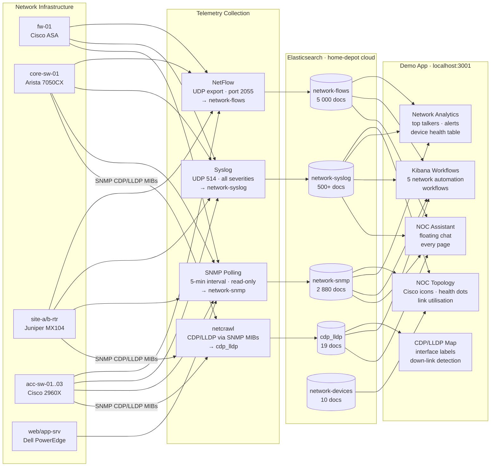
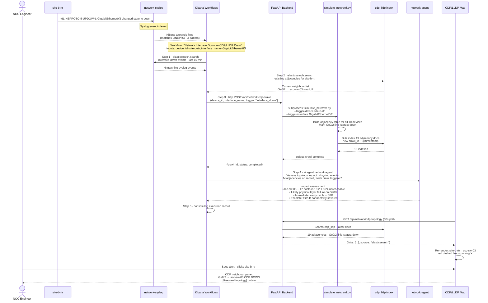
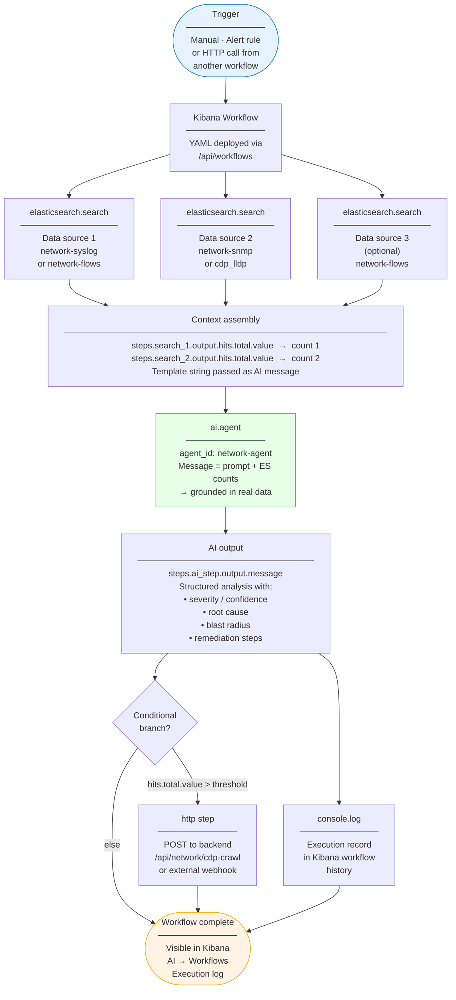
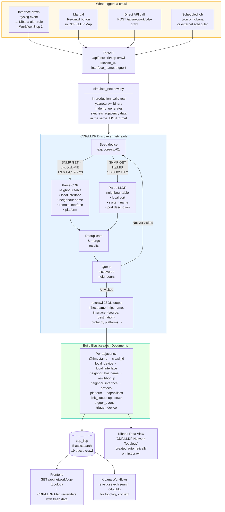

# Demo Guide: Network Operations Center

**Demo Name**: Network Operations Center (NOC)\
**Target Audience**: Network operations teams, NOC managers, infrastructure leads, security engineers\
**Primary Use Case**: Unified network telemetry — NetFlow, SNMP, syslog, CDP/LLDP — with AI-powered triage and automated workflows\
**Elastic deployment**: home-depot (us-central1 GCP)\
**Agent**: `network-agent`

---

## What This Demo Shows

Elastic as the **single pane of glass for network operations** — ingesting NetFlow, SNMP metrics, and syslog from heterogeneous devices, providing real-time topology visualisation powered by CDP/LLDP discovery, and running AI-driven workflows for anomaly triage, root cause analysis, incident response, and capacity planning.

**Core message**: *"What took your team hours of manual log correlation now takes 30 seconds with Elastic."*

| Capability | What it demonstrates |
|---|---|
| NOC Topology | Live network map with Cisco device icons, health indicators, and utilisation-coloured links |
| CDP/LLDP Map | Real adjacency data discovered by netcrawl — actual interface names, protocol badges, down-link detection |
| Network Analytics | NetFlow top talkers, SNMP device health table, syslog alert feed |
| **Impact Analysis** | Interface flap/outage → MAC→IP→hostname chain → every affected user by name, department, VLAN |
| **NetFlow Analysis** | Deep flow analysis — top talkers, protocols, ports, conversation partners, links to 8 Kibana dashboards |
| **Meraki Analysis** | Cisco Meraki event logs — URL filtering, security alerts, Air Marshal, full device inventory |
| AI Workflows | 9 deployed workflows correlating NetFlow, SNMP, syslog, MAC/ARP/DNS for AI-grounded analysis |
| Event-Driven Intelligence | Interface-down syslog → triggers CDP/LLDP crawl → topology updates automatically |
| NOC Chat Assistant | Floating AI chat on every page — ask about alerts, devices, or events |

---

## Quick Start

```bash
cd ~/elastic-demo-starter

# Start servers (already running on ports 8002 / 3001)
./dev start

# Check everything is healthy
./dev status
curl -s http://localhost:8002/api/agent/health   # should show network-agent: healthy

# Re-ingest synthetic telemetry data if needed
uv run --project backend python scripts/generate_network_telemetry.py

# Re-run CDP/LLDP crawl simulation
uv run --project backend python scripts/simulate_netcrawl.py
```

**Demo URL**: http://localhost:3001

**Kibana Dashboards** (open directly in a separate tab during the demo):

| Dashboard | Link |
|---|---|
| NOC Overview | https://home-depot.kb.us-central1.gcp.cloud.es.io/app/dashboards#/view/b12f7eb1-e40b-4c21-86b4-13849efa574a |
| NetFlow Traffic Analysis | https://home-depot.kb.us-central1.gcp.cloud.es.io/app/dashboards#/view/fd38bd9a-0100-47a6-aa53-e9fd9bb329d2 |
| CDP/LLDP Topology | https://home-depot.kb.us-central1.gcp.cloud.es.io/app/dashboards#/view/f3ebd0b7-5168-438c-a9f6-4e32c2213709 |

---

## Pre-Demo Checklist

Run these before opening the browser:

- [ ] `./dev status` — both servers green
- [ ] `curl -s http://localhost:8002/health` → `{"status":"ok","elasticsearch":"ok"}`
- [ ] `curl -s http://localhost:8002/api/agent/health` → `{"status":"healthy","agent_id":"network-agent"}`
- [ ] Open [NOC Overview dashboard](https://home-depot.kb.us-central1.gcp.cloud.es.io/app/dashboards#/view/b12f7eb1-e40b-4c21-86b4-13849efa574a) — confirm panels load with data
- [ ] Open [NetFlow Analysis dashboard](https://home-depot.kb.us-central1.gcp.cloud.es.io/app/dashboards#/view/fd38bd9a-0100-47a6-aa53-e9fd9bb329d2) — confirm top talkers visible
- [ ] Open [CDP/LLDP Topology dashboard](https://home-depot.kb.us-central1.gcp.cloud.es.io/app/dashboards#/view/f3ebd0b7-5168-438c-a9f6-4e32c2213709) — confirm 19 adjacencies, 1 link down
- [ ] Open http://localhost:3001 — app loads, nav shows NOC Topology / Network Analytics / Workflows / Chat
- [ ] Go to `/network-topology` — topology loads (devices visible, links coloured)
- [ ] Toggle to **CDP/LLDP Map** — 19 adjacencies shown, `site-b-rtr → acc-sw-03` link pulsing red
- [ ] Go to `/workflows` — 8 workflows listed including all 5 network ones

---

## Demo Tracks

### Track A — Network Visibility (5 min)

**Story**: *"Here's what your network looks like right now."*

---

#### Step 1 — Open the NOC Topology (`/network-topology`)

**What to show**:
- 11 devices laid out in a realistic enterprise topology: Internet → Firewall → Core Switch → Site routers → Access switches → DMZ servers
- Each device rendered as an official Cisco topology icon (cylinder for routers, 3D box for switches, tall appliance for firewall, rack units for servers)
- Status dots: green = healthy, amber = warning, **red = critical** (`site-b-rtr` is red — CPU 95%)
- Link colours: green = normal load, amber = 50-75%, orange = 75-90%, **red = >90%** (`core-sw-01 → site-b-rtr` is nearly saturated)
- Traffic particles flowing along links show live data movement

**Click site-b-rtr** to open the device panel. Show:
- CPU: 95% (red bar)
- Memory: 88% (warning bar)
- Vendor: Juniper MX104, Site-B/Rack-01

**Talking points**:
- "Every device here is monitored via SNMP — CPU, memory, interface error counters"
- "We can see the blast radius immediately — that red link is the path from the core to Site B"
- "Cisco, Juniper, Arista — Elastic is vendor-agnostic. It speaks SNMP to everything"

---

#### Step 2 — Switch to CDP/LLDP Map

Click the **CDP/LLDP Map** toggle in the top-right.

**What to show**:
- Same topology, but now links show **real interface names** discovered by netcrawl
- Blue links = CDP adjacencies, teal = LLDP
- Each link has abbreviated interface names at 25%/75%: `Ge0/2`, `Te0/1`, `xe-1/0/0`
- `site-b-rtr → acc-sw-03` link: **red dashed line with pulsing ✕** — this is the interface that went down
- Side panel shows: 10 devices crawled, 10 unique adjacencies, 1 link down

**Click site-b-rtr** to open the CDP panel. Show:
- `xe-1/0/0 → core-sw-01 (Te0/3)` — LLDP — **up**
- `GigabitEthernet0/2 → acc-sw-03 (Ge0/1)` — CDP — **down** ← the failed link
- "Re-crawl topology" button visible

**Talking points**:
- "netcrawl discovers adjacencies by polling CDP and LLDP via SNMP — no agents required"
- "This is actual protocol-level discovery, not hand-drawn diagrams that drift out of date"
- "When an interface goes down, the topology updates automatically via a Kibana workflow"

---

#### Step 3 — Network Analytics Dashboard (`/network-dashboard` or Kibana)

> **Kibana dashboard**: [NetFlow Traffic Analysis](https://home-depot.kb.us-central1.gcp.cloud.es.io/app/dashboards#/view/fd38bd9a-0100-47a6-aa53-e9fd9bb329d2) · [NOC Overview](https://home-depot.kb.us-central1.gcp.cloud.es.io/app/dashboards#/view/b12f7eb1-e40b-4c21-86b4-13849efa574a) · [CDP/LLDP Topology](https://home-depot.kb.us-central1.gcp.cloud.es.io/app/dashboards#/view/f3ebd0b7-5168-438c-a9f6-4e32c2213709)

#### Step 3 — Network Analytics Dashboard (`/network-dashboard`)

**What to show**:
- KPI cards: 1.28M NetFlow records (24h), 342 Mbps in, 218 Mbps out, 1 critical device
- **Top Talkers table**: `10.2.1.45 → app-srv-01 (443/TCP)` consuming 28% of traffic — highlight as anomaly
- **Recent Alerts** on the right: site-b-rtr CPU spike, app-srv memory 91%, fw-01 connection rate 4,200/sec
- **Device Health table**: all 10 devices with CPU and memory bars; site-b-rtr and app-srv highlighted in red/amber rows

**Talking points**:
- "NetFlow tells us WHO is talking to WHOM and how much bandwidth they're using"
- "That 28% flow from 10.2.1.45 to app-srv is worth investigating — it correlates with the CPU spike on site-b-rtr"
- "The device health table is pure SNMP — polled every 5 minutes, always current"

---

### Track B — AI-Powered Workflows (8 min)

**Story**: *"When something goes wrong, Elastic doesn't just alert — it tells you what it means and what to do."*

---

#### Step 4 — Open Workflows (`/workflows`)

Show the 8 deployed workflows. Focus on the 5 network ones:
- Network Anomaly Triage
- Network Root Cause Analysis
- Network Incident Response
- Network Capacity Planning
- Network Interface Down — CDP/LLDP Crawl

**Talking points**:
- "These workflows live in Kibana. They're YAML definitions that search Elasticsearch and call the AI agent"
- "They can be triggered manually, on a schedule, or by an alert rule"

---

#### Workflow Demo 1 — Anomaly Triage

**Run**: Click **Network Anomaly Triage** → Run → enter:
- `device_id`: `site-b-rtr`

**What it does**:
1. Searches `network-flows` for anomalous traffic from site-b-rtr (last 1h)
2. Searches `network-snmp` for recent SNMP metric samples
3. Calls `network-agent` to triage severity and identify root cause

**Expected AI output**: The agent will identify the CPU spike, correlate it with the high-volume flow to app-srv, and recommend immediate containment actions.

**Talking points**:
- "The workflow searches 5,000+ NetFlow records and 2,800+ SNMP samples in milliseconds"
- "The AI agent has full context: traffic volumes, device metrics, historical baseline"
- "This is the same analysis that takes a human engineer 45-60 minutes — done in 30 seconds"

---

#### Workflow Demo 2 — Root Cause Analysis

**Run**: Network Root Cause Analysis → Run → enter:
- `alert_device`: `site-b-rtr`
- `alert_description`: `CPU utilisation 95% — OSPF adjacency lost, interface GigabitEthernet0/2 down`

**What it does**:
1. Retrieves last 4h of syslog from site-b-rtr
2. Gets last 48 SNMP metric samples (4h at 5-min interval)
3. Gets related NetFlow records for the last 2h
4. Calls `network-agent` for structured RCA: timeline, root cause with confidence, blast radius, remediation steps

**Talking points**:
- "We're correlating three different data types — syslog, SNMP, NetFlow — in a single workflow"
- "The AI output isn't a generic answer — it's grounded in your actual data"
- "The blast radius analysis tells you which downstream devices are affected before your service desk gets flooded with tickets"

---

#### Workflow Demo 3 — Incident Response Runbook

**Run**: Network Incident Response → Run → enter:
- `incident_device`: `site-b-rtr`
- `incident_type`: `CPU spike and interface down`

**What it does**: Generates a full incident response runbook — immediate actions, investigation steps, remediation procedure with rollback, stakeholder communication, and post-incident tasks.

**Talking points**:
- "This is a production-quality runbook generated in seconds, not written by a senior engineer over 20 minutes"
- "Every step is grounded in actual evidence from your environment — not generic advice"

---

#### Workflow Demo 4 — Capacity Planning

**Run**: Network Capacity Planning → Run (no inputs needed — uses defaults: 7-day window, 75% threshold)

**What it does**: Analyses SNMP bandwidth data across all devices, identifies congested interfaces, and generates a capacity planning report with growth projections and upgrade recommendations.

**Talking points**:
- "Capacity planning typically requires a dedicated tool and a quarterly review meeting"
- "With Elastic and this workflow, you can run it on demand whenever you need it — and the AI grounds its recommendations in your actual utilisation patterns"

---

### Track C — Event-Driven Intelligence (4 min)

**Story**: *"Elastic doesn't just react to events — it orchestrates a response."*

---

#### Step 5 — The Interface Down Scenario

**Setup the story**: *"It's 2am. An interface goes down on site-b-rtr. Here's what happens automatically."*

**What already happened** (walk through):
1. A syslog event landed in `network-syslog`: `%LINEPROTO-5-UPDOWN: Line protocol on Interface GigabitEthernet0/2, changed state to down`
2. This is visible in the **Recent Alerts** feed on the topology page
3. The CDP/LLDP Map already shows the link as down (the pulsing red ✕)

**Now show the automated response**:

Run **Network Interface Down — CDP/LLDP Crawl** → Run → enter:
- `device_id`: `site-b-rtr`
- `interface_name`: `GigabitEthernet0/2`

**What it does**:
1. Queries `network-syslog` for interface-down events in the last 15 minutes
2. Checks existing CDP/LLDP adjacencies for site-b-rtr
3. **Calls the backend HTTP endpoint** (`/api/network/cdp-crawl`) to trigger a fresh netcrawl simulation
4. Calls `network-agent` to assess topology impact: what's unreachable, is it physical or protocol, which segments are affected

**After the workflow completes**:
- Go back to the topology page → **CDP/LLDP Map**
- The fresh crawl data is reflected — the down link is confirmed with a new timestamp
- Click **site-b-rtr** → click **Re-crawl topology** to demonstrate the manual trigger

**Talking points**:
- "This workflow can be triggered by an alert rule in Kibana — the moment a syslog matching that pattern arrives, the workflow fires automatically"
- "netcrawl does the CDP/LLDP discovery over SNMP — no agents on the devices, just standard protocols"
- "The AI knows the topology context — it can tell you exactly which downstream devices are now isolated"

---

#### Step 6 — NOC Chat Assistant

**Trigger the chat widget** on either the topology page or the analytics dashboard (floating button, bottom-right).

**Sample prompts to use**:

```
What's causing the CPU spike on site-b-rtr?
```
```
Which devices are affected by the GigabitEthernet0/2 interface going down?
```
```
What's the top bandwidth consumer in the last 24 hours and is it normal?
```
```
Give me a quick status summary of the entire network right now.
```

**Talking points**:
- "Every page has the NOC Assistant — your team can ask questions in natural language instead of writing ES|QL"
- "The agent has context from all the data we've just explored: NetFlow, SNMP, syslog, CDP/LLDP"

---

## Feature Reference

### NOC Topology (`/network-topology`)

| Element | Description |
|---|---|
| Device icons | Official Cisco topology symbols (router=cylinder, switch=3D box, firewall=appliance, server=rack) |
| Status dots | Green=healthy · Amber=warning · Red=critical — driven from SNMP CPU/memory |
| Link colours | Green <50% · Yellow 50-75% · Orange 75-90% · Red >90% utilisation |
| Traffic particles | Animated dots moving along links, speed proportional to utilisation |
| Click device | Opens device panel: CPU bar, memory bar, vendor/model, location, uptime |
| KPI cards | Total devices · Healthy · Warning · Critical · Open alerts |
| CDP/LLDP toggle | Switches to adjacency-discovery view |

### CDP/LLDP Map

| Element | Description |
|---|---|
| Blue links | CDP (Cisco Discovery Protocol) adjacencies |
| Teal links | LLDP (Link Layer Discovery Protocol) adjacencies |
| Interface labels | Abbreviated names at 25%/75% of each link (e.g. `Ge0/2`, `Te0/1`) |
| Protocol badge | `CDP` or `LLDP` badge at link midpoint |
| Red dashed + ✕ | Interface down — pulsing animation draws the eye |
| Click device | CDP/LLDP neighbour table: local interface · protocol · neighbour · remote interface · status |
| Re-crawl button | Appears when a down interface is detected; triggers fresh netcrawl run + topology refresh |
| Summary panel | Devices crawled · Unique adjacencies · Links down · Data source badge |

### Network Analytics Dashboard (`/network-dashboard`)

| Element | Description |
|---|---|
| KPI row | Total flows (24h) · Ingress bandwidth · Egress bandwidth · Critical devices · Devices healthy |
| Filter bar | IP search · Vendor pills (Cisco/Juniper/Arista) · Status pills (Healthy/Warning/Critical) |
| Top Talkers | src IP · dst IP · protocol · port · volume with bar · % of total traffic |
| Recent Alerts | Severity icon · device · message · timestamp · category |
| Device Health | Full device table with CPU/memory bars, filtered by vendor or status |
| Time filter | 1h / 6h / 24h / 7d |

### NetFlow Analysis (`/netflow`)

| Element | Description |
|---|---|
| KPI row | Total Flows · Total Bytes · Total Packets · Unique Sources · Unique Destinations |
| Traffic volume chart | SVG area chart — bytes per hour over the selected time range |
| Protocol donut | TCP / UDP / ICMP breakdown with percentages |
| Flow direction bars | Inbound · Outbound · Internal |
| Top Source IPs | Horizontal bar chart — most active senders |
| Top Destination IPs | Horizontal bar chart — most accessed destinations |
| Top Destination Ports | With service labels (443=HTTPS, 53=DNS, 22=SSH, 8883=MQTT…) |
| Top Conversation Partners | Table — src→dst, protocol, bytes, flow count |
| Kibana links bar | 8 dashboards: Overview, Top-N, Geo Location, Traffic Analysis, Flow Records, Exporters, Autonomous Systems, Conversation Partners |
| Open in Kibana button | Direct link to `[Logs Netflow] Overview` |

Works with `DATA_SOURCE=real` against `logs-netflow.log-cisco-*` (100M+ real records).

### Meraki Analysis (`/meraki`)

| Element | Description |
|---|---|
| KPI row | Total Events · URL Events · Unique Clients · Active Devices · Security Alerts · Air Marshal Events |
| Security callout | Red callout when IDS/security events detected in the period |
| Events timeline | SVG area chart — events per hour |
| By Event Type | urls / events / airmarshal_events breakdown |
| Top Active Devices | Which Meraki devices (MX68, APs) are seeing most traffic |
| Top Source IPs | Most active client IPs on the 192.168.20.x subnet |
| Top Domains | URL filtering — most visited domains |
| Device Inventory | All 15 Meraki devices: name, model, type badge, LAN IP, MAC, serial, firmware. Amber highlight for outdated firmware |
| Air Marshal feed | Rogue AP detections with device and message |
| Kibana links | `[Logs Cisco Meraki] Syslog Events Overview` + `[Metrics Cisco Meraki] Device Health Overview` |

Works with `DATA_SOURCE=real` against `logs-cisco_meraki.log-cisco-*` (13M+ real records) and `metrics-cisco_meraki_metrics.device_health-cisco-*`.

### Impact Analysis (`/network-impact`)

| Element | Description |
|---|---|
| Alert banners | One per active event (flap/outage) with bounce timeline badges |
| KPI row | Total affected · Departments · Flap events · Outage events |
| Department bar | Visual breakdown of how many devices per department are offline |
| Device type strip | Workstations · Servers · VoIP Phones · Printers count |
| Search field | Live filter across hostname, IP, MAC, FQDN, user, department, type, port |
| Department pills | Click to filter to one department (Finance, Trading, HR…) |
| Event type toggle | All / Flaps only / Outages only |
| Affected devices table | Status · Hostname · IP · MAC · VLAN · Type · User · Department · Port · Event |
| Row colouring | Amber rows = flap, red rows = outage |
| Floating chat | Ask "who is affected?", "can Trading still trade?", "what caused this?" |

**Two pre-loaded scenarios:**
- **Flap**: acc-sw-03 Gi0/1 — 5 bounces in 14 min — Finance (8), Trading (6), HR (5), NOC (4), IT (3)
- **Outage**: acc-sw-02 Gi0/3 — clean down — Operations (3), Security (2), IT (1)

### AI Workflows (`/workflows`)

| Workflow | Inputs | What it does |
|---|---|---|
| Network Anomaly Triage | `device_id` | NetFlow + SNMP → AI severity/root cause/containment |
| Network Root Cause Analysis | `alert_device`, `alert_description` | Syslog + SNMP + flows → AI RCA with blast radius |
| Network Incident Response | `incident_device`, `incident_type` | Critical syslogs + flows → AI remediation runbook |
| Network Capacity Planning | _(none required)_ | SNMP bandwidth trends → AI capacity recommendations |
| Interface Down CDP/LLDP Crawl | `device_id`, `interface_name` | Syslog + CDP/LLDP check + HTTP crawl → AI topology impact |
| **Network Flap Impact Analysis** | `trigger_device`, `trigger_interface` | Syslog + MAC table + impact chain → AI business impact ("can Trading execute?") |
| Traffic Analysis | `query` (IP/device/protocol) | NetFlow search → AI traffic behaviour + security/performance recommendations |

### Data

| Index | Documents | Content |
|---|---|---|
| `network-devices` | 10 | Device inventory: hostname, IP, type, vendor, model, location |
| `network-flows` | 5,000 | NetFlow records: src/dst IP & port, protocol, bytes, packets, direction |
| `network-snmp` | 2,880 | SNMP metrics: CPU, memory, interface utilisation, error counters (5-min intervals, 24h) |
| `network-syslog` | 500+ | Syslog events: severity, message, category, including interface-down triggers |
| `cdp_lldp` | 19 | CDP/LLDP adjacencies: local/neighbour device, interfaces, protocol, link status |
| `network-mac-table` | 46 | Switch MAC address tables: device, port, MAC, VLAN |
| `network-arp-table` | 46 | Router ARP tables: MAC → IP mappings |
| `network-dns` | 46 | DNS/DHCP records: IP → hostname, user, department, device type |
| `network-impact` | 45 | Pre-joined impact chain: flap/outage → switch port → MAC → IP → hostname → user |

---

## Synthetic Data & Baked-In Anomalies

The demo data is pre-seeded with specific anomalies to drive the story:

| Device | Anomaly | Visible in |
|---|---|---|
| `site-b-rtr` | CPU 95%, OSPF adjacency lost, `Ge0/2` interface down | Topology (red), syslog, workflows |
| `app-srv-01` | Memory 91% | Topology (amber), analytics dashboard |
| `fw-01` | Connection rate spike 4,200 sess/sec (baseline 1,100) | Alerts feed |
| `acc-sw-02` | CRC errors on `Gi0/3`: 1,847 in 5 min | Alerts feed |
| `site-b-rtr → acc-sw-03` | Link down in CDP/LLDP | CDP/LLDP Map (red ✕) |

To re-seed the data:
```bash
cd ~/elastic-demo-starter
uv run --project backend python scripts/generate_network_telemetry.py
uv run --project backend python scripts/simulate_netcrawl.py
```

---

## Configuration Reference

### Environment (`backend/.env`)

| Variable | Value | Purpose |
|---|---|---|
| `ELASTICSEARCH_URL` | `https://home-depot.es.us-central1.gcp.cloud.es.io` | Elasticsearch endpoint |
| `KIBANA_URL` | `https://home-depot.kb.us-central1.gcp.cloud.es.io` | Kibana / Agent Builder |
| `ELASTIC_API_KEY` | _(set)_ | Authentication for both ES and Kibana |
| `AGENT_ID` | `network-agent` | Agent Builder agent for all workflow AI steps |

### Kibana Resources

| Resource | Where to find |
|---|---|
| `network-agent` | Kibana → AI → Agents |
| Deployed workflows | Kibana → AI → Workflows (8 workflows) |
| `CDP/LLDP Network Topology` data view | Kibana → Discover → data view selector |
| `cdp_lldp` index | Kibana → Dev Tools → `GET cdp_lldp/_count` |
| **NOC Overview dashboard** | https://home-depot.kb.us-central1.gcp.cloud.es.io/app/dashboards#/view/b12f7eb1-e40b-4c21-86b4-13849efa574a |
| **NetFlow Traffic Analysis dashboard** | https://home-depot.kb.us-central1.gcp.cloud.es.io/app/dashboards#/view/fd38bd9a-0100-47a6-aa53-e9fd9bb329d2 |
| **CDP/LLDP Topology dashboard** | https://home-depot.kb.us-central1.gcp.cloud.es.io/app/dashboards#/view/f3ebd0b7-5168-438c-a9f6-4e32c2213709 |
| **Network Impact Analysis dashboard** | https://home-depot.kb.us-central1.gcp.cloud.es.io/app/dashboards#/view/32d04ef9-8145-44f8-95f2-8b8370d9b5d8 |
| **[Logs Netflow] Overview** _(real data)_ | https://home-depot.kb.us-central1.gcp.cloud.es.io/app/dashboards#/view/netflow-34e26884-161a-4448-9556-43b5bf2f62a2 |
| **[Logs Cisco Meraki] Syslog Events** _(real data)_ | https://home-depot.kb.us-central1.gcp.cloud.es.io/app/dashboards#/view/cisco_meraki-4832a430-af22-11ec-a899-6f7e676e0fb4 |
| **[Metrics Cisco Meraki] Device Health** _(real data)_ | https://home-depot.kb.us-central1.gcp.cloud.es.io/app/dashboards#/view/cisco_meraki_metrics-d6b9863a-88e2-4e3d-a2a7-36ca1ee525b1 |

### netcrawl

```bash
# Installed via Homebrew Ruby
export PATH="/opt/homebrew/opt/ruby/bin:/opt/homebrew/lib/ruby/gems/4.0.0/bin:$PATH"
netcrawl --help

# Source repo
ls ~/netcrawl/

# Simulate a crawl (no real devices needed)
cd ~/elastic-demo-starter
uv run --project backend python scripts/simulate_netcrawl.py \
  --trigger-device site-b-rtr \
  --trigger-interface GigabitEthernet0/2

# See what netcrawl JSON output looks like
uv run --project backend python scripts/simulate_netcrawl.py --print-netcrawl-json
```

---

## Troubleshooting

| Symptom | Fix |
|---|---|
| Topology page blank / spinner | `./dev status` — restart if needed; check `./dev logs-snapshot` |
| Workflows fail with "agent not found" | Verify `network-agent` exists in Kibana → AI → Agents |
| CDP/LLDP map shows "Demo data" | Run `uv run --project backend python scripts/simulate_netcrawl.py`; refresh page |
| No alerts in alert feed | Data older than 24h — re-run `generate_network_telemetry.py` |
| Re-crawl button doesn't update map | Wait ~3 seconds then click refresh on the topology page |
| `netcrawl: command not found` | `export PATH="/opt/homebrew/opt/ruby/bin:/opt/homebrew/lib/ruby/gems/4.0.0/bin:$PATH"` |
| Workflow shows "Untitled workflow" | YAML parsing issue — check `scripts/workflows/load_workflows.py --dry-run` |

---

## Architecture

```
Browser (localhost:3001)
    │
    ▼
Frontend — Vite + React + EUI
    │  /api/*
    ▼
Backend — FastAPI (localhost:8002)
    ├── /api/network/topology      ← SNMP device data + static topology
    ├── /api/network/alerts        ← network-syslog index (live ES)
    ├── /api/network/cdp-topology  ← cdp_lldp index (live ES)
    ├── /api/network/cdp-crawl     ← wraps simulate_netcrawl.py
    └── /api/agent/chat            ← Agent Builder SSE proxy
            │
            ├── Elasticsearch ─── network-flows, network-snmp,
            │   (Cloud)            network-syslog, network-devices, cdp_lldp
            │
            └── Kibana ─────────── network-agent (Agent Builder)
                (Cloud)             + 8 deployed Workflows
                        │
                        └── simulate_netcrawl.py ── netcrawl (ytti/netcrawl)
                                                     CDP/LLDP via SNMP
```

---

## Event-Driven Telemetry Architecture

### Diagram 1 — Overall Data Flow

How all four telemetry types travel from network devices into Elasticsearch and are consumed by the demo.



---

### Diagram 2 — Event-Driven Interface-Down Loop

The complete automated response chain — from a single syslog line to an updated topology map with AI impact assessment.



---

### Diagram 3 — AI Workflow Execution Pattern

Every network workflow follows the same pattern: search multiple indices, assemble context, call `network-agent`, log the result.



---

### Diagram 4 — CDP/LLDP Discovery: How netcrawl Works

What happens inside `simulate_netcrawl.py` every time a crawl is triggered — and how it maps to a real production `netcrawl` run.



---

### Diagram 5 — The Full Event-Driven Stack

End-to-end view showing every layer from physical interface to frontend pixel.

```
LAYER 0 — Physical Network
───────────────────────────────────────────────────────────────────────
  site-b-rtr  ──[GigabitEthernet0/2]──  acc-sw-03
                        ↕
               Cable / SFP failure

LAYER 1 — Syslog Event (milliseconds)
───────────────────────────────────────────────────────────────────────
  site-b-rtr → syslog UDP 514
  "%LINEPROTO-5-UPDOWN: Line protocol on Interface
   GigabitEthernet0/2, changed state to down"
                        ↓
  Elastic Agent / Logstash / Filebeat collects + indexes
                        ↓
  network-syslog  (@timestamp, device_id, message, severity, category)

LAYER 2 — Alert Rule (seconds)
───────────────────────────────────────────────────────────────────────
  Kibana Alert Rule
  index: network-syslog
  condition: message matches "%LINEPROTO%" AND "changed state to down"
  throttle: 5 min
                        ↓
  Fires → triggers Kibana Workflow

LAYER 3 — Workflow Execution (5–15 seconds)
───────────────────────────────────────────────────────────────────────
  Workflow: "Network Interface Down — CDP/LLDP Crawl"
  ┌─ Step 1 ──── elasticsearch.search(network-syslog) ─────────────────┐
  │             Query: device_id=site-b-rtr, event_type=interface_down  │
  │             Result: N events in last 15 min                         │
  └─────────────────────────────────────────────────────────────────────┘
  ┌─ Step 2 ──── elasticsearch.search(cdp_lldp) ───────────────────────┐
  │             Query: local_device=site-b-rtr                          │
  │             Result: current adjacency list (Ge0/2 was UP)           │
  └─────────────────────────────────────────────────────────────────────┘
  ┌─ Step 3 ──── http.POST /api/network/cdp-crawl ─────────────────────┐
  │             Payload: {device_id, interface_name, trigger}           │
  │             → runs simulate_netcrawl.py                             │
  │             → indexes 19 adjacency docs (Ge0/2: link_status=down)   │
  │             Result: {crawl_id, status: completed}                   │
  └─────────────────────────────────────────────────────────────────────┘
  ┌─ Step 4 ──── ai.agent(network-agent) ──────────────────────────────┐
  │             Context: syslog count + adjacency count + crawl result  │
  │             Output: impact assessment + remediation                  │
  └─────────────────────────────────────────────────────────────────────┘

LAYER 4 — CDP/LLDP Index Update (immediate)
───────────────────────────────────────────────────────────────────────
  cdp_lldp index
  ┌────────────────────────────────────────────────────────────────────┐
  │  @timestamp: 2026-06-05T01:34:33Z                                  │
  │  crawl_id: c8c73241-...                                             │
  │  local_device: site-b-rtr.corp.local                               │
  │  local_interface: GigabitEthernet0/2                               │
  │  neighbor_hostname: acc-sw-03.corp.local                           │
  │  neighbor_interface: GigabitEthernet0/1                            │
  │  protocol: CDP                                                      │
  │  link_status: DOWN  ← ← ← ← ← ← ← ← ← ← ← ← ← ← ← ← ← ← ← ←  │
  │  trigger_event: interface_down                                      │
  └────────────────────────────────────────────────────────────────────┘

LAYER 5 — Frontend Topology Update (30-second poll)
───────────────────────────────────────────────────────────────────────
  GET /api/network/cdp-topology
     → FastAPI reads cdp_lldp (sync ES client)
     → Returns 19 adjacency records, source: "elasticsearch"
     → CdpTopologySvg re-renders
     → site-b-rtr → acc-sw-03 link:
         stroke: #BD271E (red)
         strokeDasharray: "8,5"
         ✕ marker: pulsing animate at midpoint
     → Status dot on site-b-rtr: warning (amber)
     → Side panel click: shows Ge0/2 → acc-sw-03 CDP DOWN
                         + [Re-crawl topology] button
```

---

## Files Reference

| File | Purpose |
|---|---|
| `frontend/src/pages/NetworkTopologyPage.tsx` | NOC topology + CDP/LLDP map + view toggle |
| `frontend/src/pages/NetworkDashboardPage.tsx` | Analytics: top talkers, alerts, device health |
| `frontend/src/services/networkApi.ts` | All network API client functions and types |
| `backend/app/routes/network_telemetry.py` | `/api/network/*` endpoints (topology, alerts, summary) |
| `backend/app/routes/cdp_lldp.py` | `/api/network/cdp-*` endpoints (CDP topology, crawl trigger) |
| `scripts/generate_network_telemetry.py` | Generates NetFlow, SNMP, syslog, device data |
| `scripts/simulate_netcrawl.py` | Simulates netcrawl CDP/LLDP discovery, ingests to `cdp_lldp` |
| `scripts/workflows/network_*.yaml` | 5 network workflow YAML definitions |
| `scripts/workflows/load_workflows.py` | Deploys workflows to Kibana |
| `~/netcrawl/` | ytti/netcrawl source (Ruby, cloned from GitHub) |
| `backend/.env` | All credentials and configuration |
| `project-context.yaml` | Demo metadata and goals |

---

## Presenter Notes

### Before the Demo
- [ ] Run `./dev status` — confirm both servers running
- [ ] Open http://localhost:3001 — confirm app loads and nav is correct
- [ ] Click `site-b-rtr` on the topology — confirm red status dot and CPU panel
- [ ] Toggle to CDP/LLDP Map — confirm the pulsing red ✕ on the `site-b-rtr → acc-sw-03` link
- [ ] Go to `/workflows` — confirm 9 workflows listed and enabled
- [ ] Open `/network-impact` — confirm 45+ affected devices shown, search field works
- [ ] Pre-warm the chat widget by opening it and sending "hello" (first response may be slow)

### Timing
- Track A (Visibility): ~5 min — good for a quick intro or warm-up
- Track B (Workflows): ~8 min — the main demo, most impactful
- Track C (Event-driven): ~4 min — optional deeper dive for technical audiences
- Track D (Impact Analysis): ~6 min — operations/management audience, "who is affected?"
- Full demo end-to-end: ~20-25 min

### Key Differentiators to Emphasise
1. **No agents on devices** — CDP/LLDP discovery via SNMP, syslog via standard syslog forwarding, NetFlow via standard export
2. **Vendor-agnostic** — Cisco, Juniper, Arista, Dell all in the same view
3. **AI grounded in data** — every workflow output cites actual counts and timestamps from your environment
4. **Speed** — what a NOC engineer does in 45-60 min, Elastic does in 30 seconds

### Q&A Preparation

**Q: Do you support real devices or just simulated data?**
A: The demo runs on synthetic data so it works anywhere without network access. In production, you'd forward syslog and NetFlow to Elastic, and run netcrawl on a schedule against your actual devices via SNMP.

**Q: How does netcrawl connect to devices?**
A: It uses SNMP (read-only community string or SNMPv3 credentials). The `ytti/netcrawl` library polls CDP/LLDP MIBs to discover neighbours, then recursively crawls the network. No agents required.

**Q: Can the workflows trigger automatically, not just manually?**
A: Yes — Kibana Workflows support alert-rule triggers. You'd create an alert rule that fires when a syslog matching the interface-down pattern arrives, and have it call the workflow automatically.

**Q: What's the data latency?**
A: NetFlow and syslog are near-real-time (seconds to minutes depending on your collector). SNMP polling interval is configurable — typically 1-5 minutes. CDP/LLDP crawls can run continuously or be event-triggered.

---

*Demo version: June 2026 — Network Operations Center v1.0*\
*Contact: mark.bernard@elastic.co*
