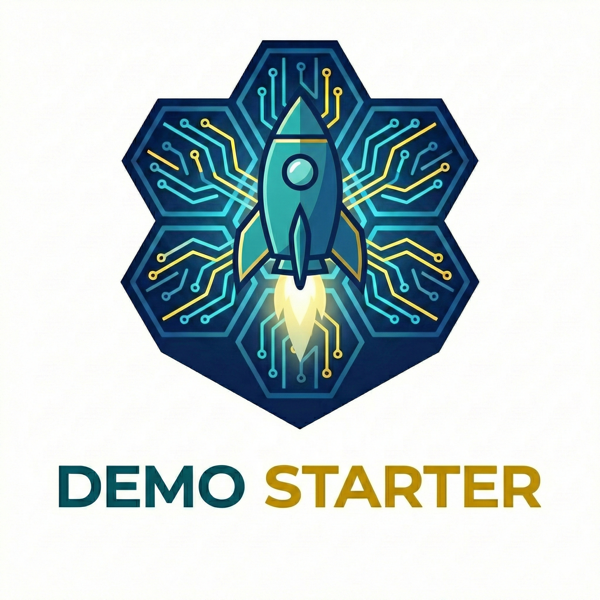

<p align="center">
  
</p>

# Elastic Demo Starter

[](https://github.com/elastic/elastic-demo-starter/actions/workflows/ci.yml)

A production-ready starter kit for building AI-powered demos with Elastic Agent Builder, EUI (Elastic UI Framework), and modern web technologies.

This repository serves as a "Golden Master" for building custom Elastic demos. It comes pre-wired with correct architectural patterns for streaming chat, multi-agent orchestration, and brand theming - avoiding common pitfalls and accelerating development.

## Architecture

```
Frontend (Vite + React + EUI)  <-->  Backend (FastAPI)  <-->  Elastic Agent Builder
         :3000                           :8001                    (Kibana API)
```

## Prerequisites

### Required: AI Coding Assistant ("Vibe Coding" Environment)

This project is designed for **AI-assisted development**. You'll need one of:

| Tool | Setup |
|------|-------|
| **[Cursor](https://cursor.sh)** | IDE with built-in AI (recommended) |
| **[Claude Code](https://claude.ai)** | VS Code extension |
| **GitHub Copilot** | Works, but won't use hive-mind patterns |

The setup script configures context files (`.cursorrules`, `CLAUDE.md`) that teach your AI assistant about the project patterns.

### System Requirements

Run `./preflight-check.sh` to verify all requirements, or check manually:

| Requirement | Minimum | Purpose | Status |
|-------------|---------|---------|--------|
| **Python** | 3.8+ | Backend server (FastAPI) | **Required** - setup fails if missing/old |
| **Node.js** | 18+ | Frontend build (Vite) | **Required** - warns if older |
| **Git** | Any | Clone repo, submodules | **Required** |
| GitHub CLI (`gh`) | Any | Easier cloning/auth | Recommended |
| Yarn | Any | Faster npm alternative | Recommended |
| Firecrawl MCP | - | AI branding extraction | Optional (see [PREREQUISITES.md](./PREREQUISITES.md)) |
| Docker | Any | Container deployment | Optional |
| Beads (`bd`) | Any | Issue tracking | Optional |

### Elastic Requirements

You'll need access to an **Elastic Agent Builder** deployment:
- Kibana URL (e.g., `https://my-deployment.kb.us-west2.gcp.elastic-cloud.com`)
- API Key (created in Kibana → Stack Management → API Keys)
- Agent ID (from Agent Builder)

---

## Quick Start

### 0. Pre-flight Check (Recommended)

After cloning, verify your environment has all prerequisites:

```bash
./preflight-check.sh
```

This checks for Python 3.8+, Node.js 18+, Git, and optional tools like GitHub CLI and Yarn. Run this **before** `./setup.sh` to catch issues early.

> **Full prerequisites guide**: See [PREREQUISITES.md](./PREREQUISITES.md) for detailed installation instructions.

### 1. Clone the Repository

```bash
# Using GitHub CLI (recommended)
gh repo clone elastic/elastic-demo-starter my-demo

# OR using git directly
git clone https://github.com/elastic/elastic-demo-starter.git my-demo

cd my-demo
```

**Need GitHub CLI?**
```bash
brew install gh    # macOS
gh auth login      # Authenticate
```

### 2. Initialize Submodules

```bash
git submodule update --init --recursive
```

This downloads the `hive-mind/` shared knowledge base.

### 3. Run the Setup Wizard

```bash
./setup.sh
```

The wizard will:
1. ✅ **Validate environment** - Python 3.8+ (fails early if too old), Node.js 18+ (warns if older)
2. 🔌 **Check network** - Verifies connectivity to Elastic Cloud, npm, PyPI
3. 📦 **Initialize submodules** - Offers to fix if hive-mind is empty
4. 🎯 **Ask which features you want to configure:**
   - Agent Builder (Chat, Demo, Audit, MCP)
   - Elasticsearch (Search Page, Analytics, Faceted Search)
   - OpenTelemetry (APM Traces, Click Tracking)
   - LLM Proxy (A2A Multi-Agent)
5. 🔧 **Validate credentials** - Warns if API key format looks wrong
6. 📦 **Install dependencies** - Shows errors if installation fails
7. 🎨 **Set up branding** (optional)
8. 🚀 **Launch the demo**

> **Tip**: You can re-run `./setup.sh` anytime to add more features or change configuration.

### Running the Demo

After setup, use the `./dev` script to manage servers:

```bash
./dev start       # Start servers in background
./dev stop        # Stop servers
./dev status      # Check if running
./dev verify      # Quick health check (setup, config, servers)
./dev test-agent  # Test Agent Builder connectivity
./dev logs        # View server logs (follows)
./dev logs-snapshot  # View recent logs and exit
./dev open        # Open browser
```

Both servers **auto-reload** on code changes - no restart needed!

- Frontend: http://localhost:3000  
- Backend API: http://localhost:8001/docs

### After Setup: Onboarding Your AI Assistant

Once the servers are running, **open the project in Cursor or VS Code** and tell your AI:

```
Read and follow ONBOARDING.md
```

This will:
1. ✅ Verify your environment is correctly set up
2. 🧠 Load the hive-mind patterns into context
3. 🎨 Set up branding (if you provided a URL during setup)
4. 📋 Configure beads issue tracking (if installed)

After onboarding, you're ready to **vibe code** - ask your AI to add features, fix bugs, or customize the UI!

### Manual Dependency Setup (Advanced)

If you prefer to skip the wizard and set things up manually:

```bash
# Backend
cd backend
python3 -m venv venv
source venv/bin/activate  # Windows: venv\Scripts\activate
pip install -r requirements.txt
cp .env.example .env      # Edit with your Elastic credentials
python run.py

# Frontend (separate terminal)
cd frontend
yarn install
yarn dev
```

## Deployment (Docker)

This project includes a production-ready `docker-compose` setup.

### Prerequisites
- Docker Desktop installed
- Valid `.env` file in `backend/.env` (created via setup script)

### Build and Run

```bash
docker-compose up --build
```

The app will be available at:
- Frontend: http://localhost:3000
- Backend: http://localhost:8000

### Architecture in Docker
- **Frontend**: Nginx container serving static React assets. Proxies `/api` requests to the backend.
- **Backend**: Python container running FastAPI with Uvicorn.


```env
KIBANA_URL=https://your-deployment.kb.region.gcp.elastic-cloud.com
ELASTICSEARCH_URL=https://your-deployment.es.region.gcp.elastic-cloud.com
ELASTIC_API_KEY=your_base64_api_key
AGENT_ID=your-agent-id
PORT=8001
```

### Frontend

No `.env` needed! The Vite config proxies `/api` to the backend automatically.

## Features

### Agent Builder Integration
- ✅ SSE streaming chat with Agent Builder
- ✅ Real-time reasoning display
- ✅ Tool call visualization
- ✅ Conversation persistence & audit trail
- ✅ Stream cancellation

### Search & Analytics
- ✅ Elasticsearch search with faceted filtering
- ✅ RetrieverBuilder for advanced queries
- ✅ Search analytics (CTR, MRR, zero-results tracking)
- ✅ ES|QL powered dashboards

### Multi-Agent (A2A)
- ✅ LLM coordinator for multi-agent orchestration
- ✅ Connect multiple Agent Builder agents
- ✅ Unified conversation interface

### Observability
- ✅ OpenTelemetry instrumentation
- ✅ APM traces for backend & search
- ✅ Click tracking & user journey analysis

### UI & Branding
- ✅ Dark/light theme toggle
- ✅ Multi-brand theming with Brand Editor
- ✅ AI-powered brand extraction from websites
- ✅ EUI (Elastic UI) components
- ✅ Accessible chat interface

### Developer Experience
- ✅ Pre-flight environment check script
- ✅ Interactive setup wizard with validation
- ✅ Hot-reload for frontend & backend
- ✅ MCP server explorer

## Branding

This starter includes built-in support for multiple brand themes.

### Creating Your First Brand

There are two approaches to branding:

**Option 1: Brand Editor (Quick & Manual)**

Visit http://localhost:3000/brands to:
- Create new brands with color pickers
- Upload logos for light/dark modes
- Preview and switch between brands

Brands are stored in `backend/data/brands.json`.

**Option 2: AI-Powered Extraction (Recommended)**

For production-quality branding, use vibe coding to extract from a website:

```
"Extract branding from https://customer-website.com and create a theme file"
```

This creates a complete theme file with colors, fonts, logos, and CSS variables. **The brand is automatically discovered and registered** - no manual registration needed!

See `hive-mind/patterns/branding/BRANDING_EXTRACTION_PATTERNS.md` for the full extraction guide.

### Full Documentation

For complete branding documentation including:
- BrandTheme interface
- CSS variables reference
- Component patterns
- Troubleshooting

See **[BRANDING.md](./BRANDING.md)**

## Issue Tracking with Beads (Optional)

This project optionally supports **[Beads](https://github.com/benbarten/beads)** (`bd`), a lightweight issue tracker designed for AI-assisted development.

### Why Beads?

- 📋 Track tasks with dependencies (blockers)
- 🤖 AI assistants can read `bd ready` to see available work
- 🔗 Reference issues in commits: `[bd-XX] description`
- 📁 All data stored locally in `.beads/` (no external service)

### Setup

The setup script offers to install beads. If you skipped it:

```bash
# Install (requires Go)
go install github.com/benbarten/beads/cmd/bd@latest

# Initialize in your project
bd init
```

### Usage

```bash
bd ready                    # What can I work on? (no blockers)
bd list --status open       # All open issues
bd create "Add dark mode" --type feature
bd close bd-01 -r "Implemented in commit abc123"
```

### AI Integration

When beads is configured, your AI assistant will:
1. Check `bd ready` before starting work
2. Reference issues in commits: `[bd-XX] description`
3. Suggest closing issues when work is complete

See `hive-mind/meta/workflows/BEADS_ISSUE_TRACKER.md` for the full workflow guide.

---

## Hive Mind - Shared Knowledge Base

This project includes **Hive Mind** (`./hive-mind/`), a shared knowledge base of patterns, troubleshooting guides, and AI context. It's designed to accelerate development by providing verified, working solutions.

### What's in Hive Mind?

```
hive-mind/
├── patterns/              # 🏗️ Reusable Architecture
│   ├── elastic/           # Agent Builder, Search, RAG integration
│   │   ├── AGENT_BUILDER_INTEGRATION.md
│   │   └── STREAMING_CHAT_UI_PATTERNS.md
│   ├── eui/               # UI Framework patterns
│   │   ├── EUI_VITE_INTEGRATION.md
│   │   └── EUI_NEXTJS_INTEGRATION.md
│   ├── branding/          # Dynamic theming
│   │   └── BRANDING_EXTRACTION_PATTERNS.md
│   └── deployment/        # Docker, production setup
│       └── DOCKER_PRODUCTION_SETUP.md
├── troubleshooting/       # 🔧 Known Issues & Fixes
└── meta/                  # 🤖 AI Configuration
    ├── workflows/         # Process guides (issue tracking, etc.)
    └── prompts/           # Customization prompts
```

### How It Works

When you use an AI coding assistant (Cursor, Claude Code, etc.) with this project:

1. **AI reads the patterns** - Your assistant sees verified solutions
2. **No reinventing wheels** - Common problems already solved
3. **Consistent quality** - Everyone follows the same "golden path"

### Contributing to Hive Mind

Found a better pattern? Fixed a tricky bug? **Share it!**

Hive Mind is a [git submodule](https://github.com/elastic/hive-mind) - your contributions help everyone:

```bash
# Make changes inside hive-mind/
cd hive-mind

# Commit and push (you need write access, or fork it)
git add .
git commit -m "Add pattern for XYZ"
git push

# Then update the submodule reference in the parent repo
cd ..
git add hive-mind
git commit -m "Update hive-mind submodule"
```

**Contribution guidelines:**
- 🎯 **Be generic** - Patterns should work for any customer/use case
- 🔒 **Sanitize** - No API keys, customer names, or specific URLs
- 📝 **Explain why** - AI needs context, not just code

See [hive-mind/README.md](./hive-mind/README.md) for full contribution guide.

---

## Project Structure

```
├── backend/                   # Python FastAPI server
│   ├── app/
│   │   ├── main.py           # FastAPI app entry
│   │   ├── config.py         # Environment config
│   │   └── routes/
│   │       ├── agent.py      # Agent Builder proxy
│   │       └── branding.py   # Brand CRUD API
│   ├── data/
│   │   └── brands.json       # Stored brand configs
│   └── requirements.txt
│
├── frontend/                  # Vite + React + EUI
│   ├── src/
│   │   ├── App.tsx           # Router setup
│   │   ├── pages/            # Page components
│   │   ├── components/
│   │   │   ├── chat/         # Chat UI components
│   │   │   ├── layout/       # Headers, theme toggle
│   │   │   └── branding/     # Brand switcher
│   │   ├── branding/         # Theme definitions
│   │   ├── hooks/
│   │   │   └── useAgentChat.ts
│   │   └── services/
│   │       └── agentApi.ts   # SSE client
│   └── vite.config.ts
│
├── hive-mind/                 # 🧠 Shared knowledge base (submodule)
│   └── (see above)
│
├── scripts/
│   └── interactive_setup.py  # Setup wizard
│
├── preflight-check.sh        # Pre-clone environment check
├── setup.sh                  # Setup launcher
├── dev                       # Server management script
├── PREREQUISITES.md          # Detailed prerequisites guide
├── ONBOARDING.md             # AI assistant onboarding prompt
└── BRANDING.md               # Branding documentation
```

## Key Lessons Learned

### API Endpoint Discovery

The Agent Builder streaming endpoint is:
```
POST /api/agent_builder/converse/async
```

NOT `/api/agent_builder/agent/{id}/chat` as you might expect.

### SSE Event Types

| Event | Description |
|-------|-------------|
| `conversation_id_set` | New conversation started |
| `reasoning` | Agent thinking step |
| `thinking_complete` | Ready for text |
| `message_chunk` | Streaming text chunk |
| `message_complete` | Full response complete |

### Keepalive Handling

Agent Builder sends keepalive lines (`: 000000...`) that must be filtered out in the SSE parser.

### Backend Proxy Pattern

Use `iter_content(chunk_size=None)` NOT `iter_lines()` to preserve SSE newlines:

```python
for chunk in upstream_response.iter_content(chunk_size=None):
    if chunk:
        yield chunk
```

## API Reference

### Chat Endpoint

```bash
POST http://localhost:8001/api/agent/chat
Content-Type: application/json

{
  "input": "Hello Agent",
  "conversation_id": "optional-for-continuation"
}
```

Returns: SSE stream

### Health Check

```bash
GET http://localhost:8001/api/agent/health
```

## Contributing

There are **two ways to contribute**, depending on what you're improving:

### 1. Contribute to Hive Mind (Patterns & Knowledge)

Found a solution to a tricky problem? Add it to **hive-mind** so everyone benefits:

```bash
cd hive-mind
# Add your pattern to the appropriate directory
# e.g., hive-mind/patterns/elastic/MY_NEW_PATTERN.md
git add .
git commit -m "Add pattern for handling XYZ"
git push  # (requires write access, or fork hive-mind repo)
```

**What to contribute to hive-mind:**
- 🔧 Troubleshooting guides for common errors
- 🏗️ Reusable architecture patterns
- 📝 AI context and prompts

### 2. Contribute to the Starter (Code & Features)

For code changes, use the **fork workflow**:

1. **Fork this repository** on GitHub

2. **Clone your fork:**
   ```bash
   git clone https://github.com/YOUR_USERNAME/elastic-demo-starter.git
   cd elastic-demo-starter
   git submodule update --init --recursive
   ```

3. **Add upstream remote:**
   ```bash
   git remote add upstream https://github.com/elastic/elastic-demo-starter.git
   ```

4. **Run setup:** `./setup.sh`

5. **Create a branch, make changes, push, and open a PR**

**What to contribute to the starter:**
- 🐛 Bug fixes
- ✨ New features
- 🎨 Brand themes (add to `frontend/src/branding/`)
- 📝 Documentation

### Syncing Updates

```bash
git fetch upstream
git merge upstream/main
git submodule update --init --recursive  # Also update hive-mind
```

---

## Re-running Setup

You can re-run `./setup.sh` anytime to:
- Add new feature configurations (Agent Builder, LLM Proxy, etc.)
- Modify existing connections
- Reset and start fresh

The wizard remembers what's already configured and lets you choose what to update.

---

## Troubleshooting

### Quick Diagnostics

```bash
./preflight-check.sh  # Check prerequisites
./dev verify          # Check setup completeness
./dev status          # Check if servers running
./dev logs-snapshot   # View recent logs
./dev test-agent      # Test Agent Builder connection
```

### Common Issues

| Issue | Solution |
|-------|----------|
| "Python not found" or version too old | Install Python 3.8+: `brew install python3` |
| "Node not found" or version too old | Install Node 18+: `brew install node` |
| hive-mind folder empty | Run: `git submodule update --init --recursive` |
| API key errors (401) | Regenerate key in Kibana → Stack Management → API Keys |
| Agent not found | Run `./setup.sh` to list and select valid agents |
| Frontend won't start | Check `./dev logs-snapshot`, try `cd frontend && yarn install` |
| Backend won't start | Check `./dev logs-snapshot`, try `cd backend && ./venv/bin/pip install -r requirements.txt` |

### Detailed Troubleshooting

See **[hive-mind/troubleshooting/](./hive-mind/troubleshooting/)** for in-depth guides:
- [Agent Builder Error Reference](./hive-mind/troubleshooting/AGENT_BUILDER_ERROR_REFERENCE.md)
- [OTel Environment Variables](./hive-mind/troubleshooting/OTEL_ENV_VAR_FORMATTING.md)

