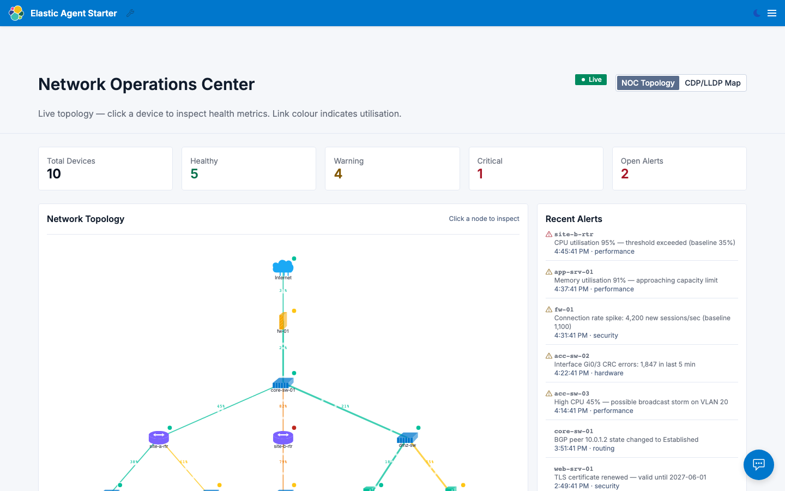
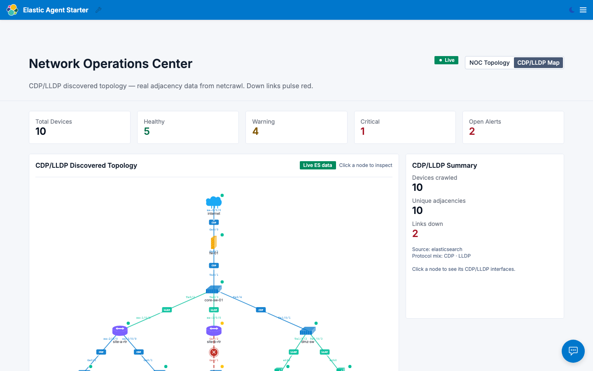
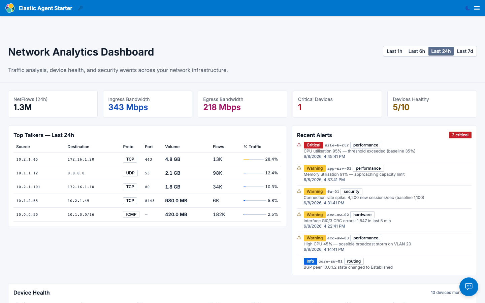
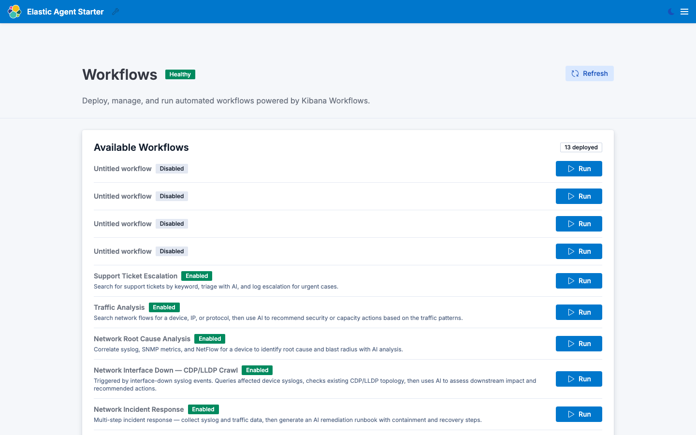
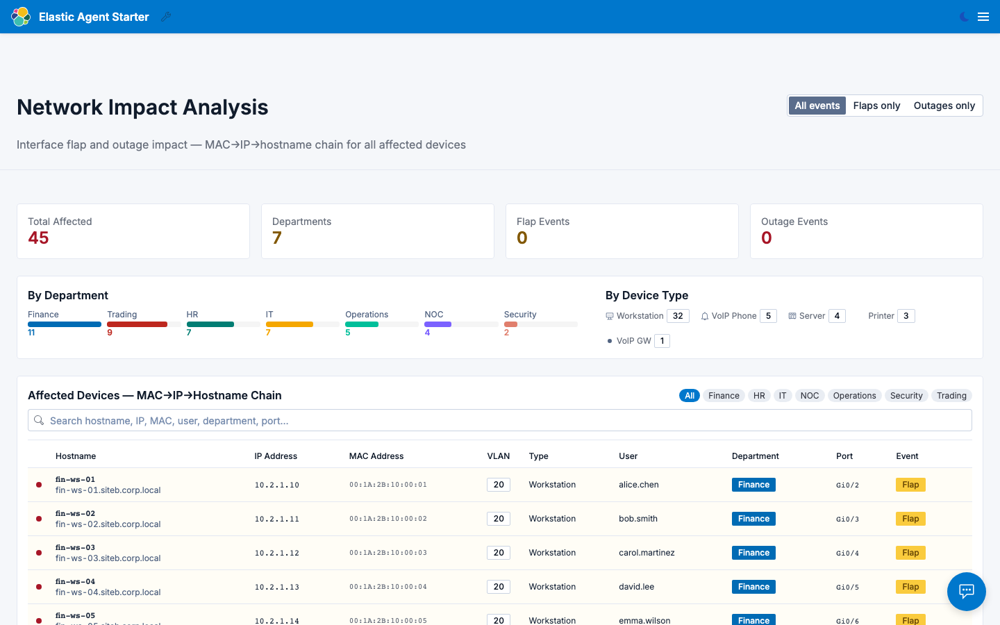

<!-- _class: cover -->

# Network Operations Center
## Unified telemetry · AI-powered workflows · Real-time topology

**Elastic NOC Demo** · mark.bernard@elastic.co

*NetFlow · SNMP · Syslog · CDP/LLDP · Impact Analysis*

---

## The Problem

Network teams are drowning in alert noise across **disconnected tools**.

| Challenge | Today | With Elastic |
|---|---|---|
| Alert correlation | Manual, 45-60 min per incident | Automated, 30 seconds |
| Topology accuracy | Hand-drawn diagrams that drift | Live CDP/LLDP discovery |
| Impact assessment | "Which users are down?" takes hours | MAC→IP→hostname chain, instant |
| Root cause analysis | 3 separate tools + a senior engineer | One workflow, AI-grounded answer |

**Core message**: *"What took your team hours now takes 30 seconds."*

---

## Demo Architecture

```
Network Devices (Cisco · Juniper · Arista · Dell)
    │
    ├── NetFlow (UDP 2055)   → network-flows   5,000 records
    ├── SNMP polling         → network-snmp    2,880 samples
    ├── Syslog (UDP 514)     → network-syslog  500+ events
    ├── CDP/LLDP (netcrawl)  → cdp_lldp        19 adjacencies
    └── MAC/ARP/DNS          → network-impact  45 devices
                                    │
                            Elasticsearch (home-depot cluster)
                                    │
                    ┌───────────────┼───────────────┐
                Frontend (React)  FastAPI      Kibana Workflows
                /noc/             :8002          9 workflows
```

---

## Track A — NOC Topology



**Cisco topology icons** · SNMP health dots · Utilisation-coloured links · Animated traffic particles

---

## Track A — CDP/LLDP Map



**Real adjacency discovery** via netcrawl · Interface labels (Ge0/2, Te0/1) · Red ✕ = link down · Protocol badges (CDP/LLDP)

---

## Track A — Network Analytics Dashboard



**1.28M NetFlow records** · Top talkers · Protocol breakdown · SNMP device health table · Syslog alert feed

---

## Track B — AI Workflows



**9 deployed workflows** — each searches ES indices, correlates data, calls `network-agent` for AI-grounded analysis

---

## Track B — Workflow Capabilities

| Workflow | What the AI answers |
|---|---|
| Anomaly Triage | "Severity? Root cause? Containment commands?" |
| Root Cause Analysis | "Timeline, blast radius, remediation steps" |
| Incident Response | Full runbook with rollback + stakeholder comms |
| Capacity Planning | "Which links fail first? Upgrade recommendations" |
| Interface Down + CDP/LLDP | "Which devices are now isolated?" |
| **Flap Impact Analysis** | **"Can Trading still execute? Is HR accessible?"** |
| Traffic Analysis | "Security concerns? Performance recommendations?" |

> *Every answer is grounded in real data — not generic advice*

---

## Track D — Impact Analysis



**Interface flap/outage → every affected user** · Search · Department filter · Two live scenarios

---

## Track D — The MAC→IP→Hostname Chain

Three data sources joined automatically:

```
Switch MAC table      acc-sw-03 Gi0/5  → 00:1A:2B:10:00:05
        ↓ ENRICH mac-to-ip
Router ARP table      00:1A:2B:10:00:05 → 10.2.1.14
        ↓ ENRICH ip-to-hostname
DNS / DHCP records    10.2.1.14 → fin-ws-05.siteb.corp.local
                                   emma.wilson · Finance · Floor 2
```

**ES|QL live query in Kibana:**
```sql
FROM network-mac-table
| WHERE device_id == "acc-sw-03"
| ENRICH mac-to-ip ON mac_address
| ENRICH ip-to-hostname ON ip_address
| KEEP vlan_id, mac_address, ip_address, hostname, user_name, department
```

---

## Track D — Two Scenarios

### Flap: acc-sw-03 GigabitEthernet0/1
*5 state changes in 14 minutes — **35 users** offline*

| Department | Users | Device Types |
|---|---|---|
| Finance | 8 | Workstations, VoIP phones |
| Trading | 6 + 2 servers | Workstations, algo servers |
| HR | 5 | Workstations |
| NOC | 4 | Workstations |
| IT | 3 | Workstations |

### Outage: acc-sw-02 GigabitEthernet0/3
*Clean down — CRC errors — **8 users** offline (Operations, Security, IT)*

---

## Kibana Dashboards

Four dashboards deployed to the home-depot cluster:

| Dashboard | Link |
|---|---|
| NOC Overview | CPU/memory bars, syslog alerts, device health |
| NetFlow Traffic Analysis | Top talkers, protocol donut, traffic timeline |
| CDP/LLDP Topology | Adjacency table, protocol mix, down links |
| **Network Impact Analysis** | **MAC→IP table, IP→User table, full impact chain** |

*Browse: https://home-depot.kb.us-central1.gcp.cloud.es.io/app/dashboards*

---

## Live Demo URLs

| Page | URL |
|---|---|
| **NOC Topology** | https://demos.gcp.elasticsa.co/noc/network-topology |
| **CDP/LLDP Map** | Toggle on topology page |
| **Network Analytics** | https://demos.gcp.elasticsa.co/noc/network-dashboard |
| **Impact Analysis** | https://demos.gcp.elasticsa.co/noc/network-impact |
| **Workflows** | https://demos.gcp.elasticsa.co/noc/workflows |
| **NOC Overview dashboard** | https://home-depot.kb.us-central1.gcp.cloud.es.io/app/dashboards#/view/54212b01-e39d-4ee7-adf4-ef756b48a2f8 |
| **Impact Analysis dashboard** | https://home-depot.kb.us-central1.gcp.cloud.es.io/app/dashboards#/view/32d04ef9-8145-44f8-95f2-8b8370d9b5d8 |

---

## Key Differentiators

1. **No agents on devices** — CDP/LLDP and SNMP over standard protocols already configured
2. **Vendor-agnostic** — Cisco, Juniper, Arista, Dell all in the same map
3. **AI grounded in data** — every workflow answer cites actual counts and timestamps
4. **Full identity chain** — MAC → IP → hostname → user → department, automated
5. **Event-driven** — syslog triggers workflows automatically, no human in the loop

---

<!-- _class: cover -->

## Thank You

**Mark Bernard** · mark.bernard@elastic.co

*Source: https://github.com/bernarmn-mnb/network-ops-demo*

*Elastic demo platform: https://demos.gcp.elasticsa.co/noc/*
